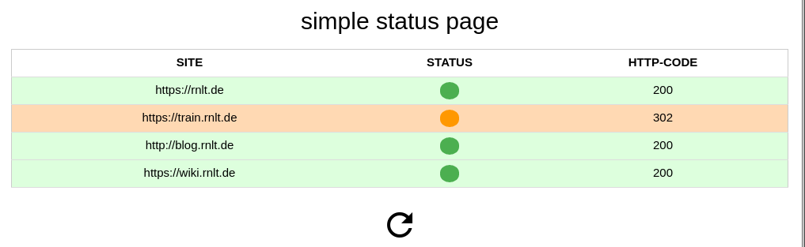

# status page

[](https://gitlab.com/alexandersperling/status.sprlng.de/commits/master)

a simple web app to monitor HTTP status of one or more webpages

## How to run this project local with Docker

### prerequisites

+ system with docker
+ basic docker knowledge

---
1. clone this repo to your local machine
2. build the container image
``` bash
docker build -t status.
```
3. run the following command to start the container and expose its port 8083 to your localhost port 80
``` bash
docker run -d -p 80:8083 -v /path/to/the/src/code/folder:/var/www/status.sprlng.de status
```

## TO DO
* move source code to python - e.g. flask?
* add control structure to follow redirects

### screenshot


